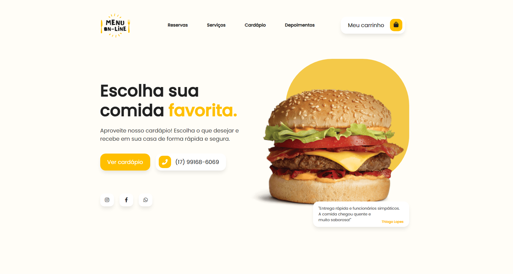

<h1 align="center"> WebMenu </h1>

Página feita do zero através do curso do <a href="https://www.frontlee.com.br/cursos/cardapio-online-com-whatsapp.html?fbclid=PAAaZ2a21KiBym_qMPZjS8FrUy6W0zYrpFFVAUVrpApurDhs-6W9Yl-Ds71Cs_aem_AQBI8YZPDBTTPUNCJaLKPpbK8c_ICpuiEHT3_iPcvrL2vndPgWkJey0jEh5NpRDHQ5y-iUictkIXGNwF5qqc1RRP">FrontLee</a>.

  <a href="#-tecnologias">Tecnologias</a>&nbsp;&nbsp;&nbsp;|&nbsp;&nbsp;&nbsp;
  <a href="#-projeto">Projeto</a>

  

## 🚀 Tecnologias

Esse projeto foi desenvolvido com as seguintes tecnologias:

- HTML e CSS
- JavaScript
- Git e Github
- Bootstrap
- jQuery

## 💻 Projeto

O WebMenu é uma página de cardápio responsiva e com integração direta ao whatsapp, perfeita para restaurantes e lanchonetes.

- [Acesse o projeto finalizado, online](https://matvzn.github.io/WebMenu/)
 

---
Feito por Matteo